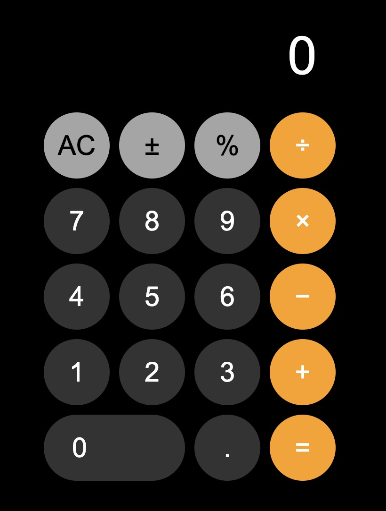

# 📱 iOS-Style Calculator

A sleek and responsive calculator built using **HTML**, **CSS**, and **JavaScript**, inspired by the iOS calculator app.



---

## 🚀 Features

- ✅ Clean iOS-style UI with dark mode
- ✅ Responsive button layout
- ✅ Functional operations: `+`, `-`, `×`, `÷`, `=`, `%`, `±`, `AC`
- ✅ Keyboard support (optional)
- ✅ Built from scratch without any libraries

---

## 📂 Project Structure

```bash
calculator/
├── index.html # Main HTML file
├── style.css # iOS-style UI and button design
├── index.js # Calculator logic
├── screenshot.png # UI preview (optional)
└── README.md # Project documentation
```

---

## 🧪 Live Preview

> 💡 *You can host this on GitHub Pages:*

1. Push your code to GitHub.
2. Go to your repository > Settings > Pages.
3. Select the root folder and `main` branch.
4. Share the public URL!

---

## 💻 How to Run Locally

1. Clone the repository:
   
   ```bash
   git clone https://github.com/your-username/ios-calculator.git
   ```

2. Navigate to the folder

   ```bash
   cd ios-calculator
   ```

3. Open index.html in your browser:

  ```bash
  open index.html
  ```

---

### ✅ To Use:

1. Replace:
   - `screenshot.png` with your actual image filename
   - GitHub and LinkedIn links with yours
2. Save it as `README.md` in the same folder as your project files.
3. Commit and push to GitHub!

